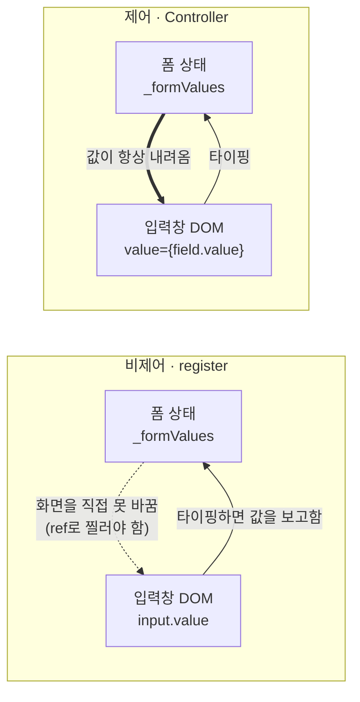

# React Hook Form(RHF)
DOM/ref와 내부 store가 입력값을 들고, 필요한 곳만 subscribe해서 React 렌더를 일으키는 **uncontrolled-first** 방식
> React Hook Form 공식 문서 : [React Hook Form](https://react-hook-form.com/)

> 💡 useState vs react-hook-form 
> - useState의 경우 state가 입력값의 SOT인 **controlled** 방식
> - useState는 로그인, 검색창 처럼 필드가 적은 경우에만 사용
>   - 단, 옵션이 많은 검색창/필터라면 RHF 써도 됨
>   - HTML 관점에서도 `<search>` 는 검색/필터링 기능을 수행하는 `<form>` 컨트롤 영역을 나타내는 용도
>   - [search MDN 참고](https://developer.mozilla.org/en-US/docs/Web/HTML/Reference/Elements/search)
>   - 단, RHF를 “필터 UI의 임시 입력 상태 관리”로 쓰고, 최종 필터 상태는 URL search params나 query key와 동기화하는 구조로 사용해야함
>   - [Query Params syncronization 참고](https://github.com/orgs/react-hook-form/discussions/8126)
> - react-hook-form 이점을 많이 살리려면 Input같은 비제어 컴포넌트는 uncontrolled 방식으로 사용

## 사용 방법

- Input같은 비제어 컴포넌트는 uncontrolled 방식으로 사용하는 것이 효율적
- 폼이 길어도 하나에 정의하는 것이 효율적
  - **watch() 최적화**: 한 번만 호출하여 전체 폼 값 추적(분리된 각 섹션마다 호출시 비효율적)
  - **리렌더링 최소화**: 불필요한 컴포넌트 분리로 인한 추가 리렌더링 방지
  - **메모리 효율성**: 단일 컴포넌트로 메모리 사용량 최적화
  - **상태 관리 단순화**: 복잡한 props 전달과 상태 동기화 불필요(오버헤드 발생)

## 1. useForm

최소한의 재렌더링으로 form을 검증하고 손쉽게 관리할 수 있는 커스텀 훅

### 1.1. 기본적인 사용방법

```tsx
import { useForm, SubmitHandler } from "react-hook-form"

/* 폼 인터페이스 정의 */
interface FormInput {
  firstName: string
  lastName: string
  age: number
}

export default function App() {

  /* useForm, SubmitHandler에 인터페이스 추가 */
  const { register, handleSubmit } = useForm<FormInput>()
  const onSubmit: SubmitHandler<FormInput> = (data) => console.log(data)

  return (
    <form onSubmit={handleSubmit(onSubmit)}>
      <input {...register("firstName", { required: true, maxLength: 20 })} />
      <input {...register("lastName", { pattern: /^[A-Za-z]+$/i })} />
      <input type="number" {...register("age", { min: 18, max: 99 })} />
      <input type="submit" />
    </form>
  )
}
```
> 💡 zod를 안쓰는 경우 아래 기능들 추가 검토
> - required, min, max, minLength, maxLength, pattern, validate 등 체크 가능
> - 타입스크립트 사용시 인터페이스(ex. FormInput) 정의해놓으면 타입체크도 가능

> 💡 register 사용시 숫자를 사용하고 싶은 경우 주의사항
> ```tsx
> {...register('totalScore', {
>    setValueAs: (value) => Number(value || 0),
> })}
> ```
> HTML input은 RHF register로 받으면 기본 값이 문자열이기 때문에 서버에 숫자로 보내야하는 경우 변환 필요. (가급적이면 서버에 보낼때도 문자로)

### 1.2. 커스텀 컴포넌트 통합

```tsx
import Select from "react-select"
import { useForm, Controller, SubmitHandler } from "react-hook-form"
import { Input } from "@material-ui/core"

interface FormInput {
  firstName: string
  lastName: string
  iceCreamType: { label: string; value: string }
}

const App = () => {
  const { control, handleSubmit } = useForm({
    defaultValues: {
      firstName: "",
      lastName: "",
      iceCreamType: {},
    },
  })

  const onSubmit: SubmitHandler<FormInput> = (data) => {
    console.log(data)
  }

  return (
    <form onSubmit={handleSubmit(onSubmit)}>
      <Controller
        name="firstName"
        control={control}
        render={({ field }) => <Input {...field} />}
      />
      <Controller
        name="iceCreamType"
        control={control}
        render={({ field }) => (
          <Select
            {...field}
            options={[
              { value: "chocolate", label: "Chocolate" },
              { value: "strawberry", label: "Strawberry" },
              { value: "vanilla", label: "Vanilla" },
            ]}
          />
        )}
      />
      <input type="submit" />
    </form>
  )
}
```

### 1.3. 에러처리

```tsx
import { useForm } from "react-hook-form"

export default function App() {
  const {
    register,
    formState: { errors }, /* 에러 상태 확인 */
    handleSubmit,
  } = useForm()
  const onSubmit = (data) => console.log(data)

  return (
    <form onSubmit={handleSubmit(onSubmit)}>
      <input
        {...register("firstName", { required: true })}
        aria-invalid={errors.firstName ? "true" : "false"}
      />
      {errors.firstName?.type === "required" && (
        <p role="alert">First name is required</p>
      )}

      <input
        {...register("mail", { required: "Email Address is required" })}
        aria-invalid={errors.mail ? "true" : "false"}
      />
      {errors.mail && <p role="alert">{errors.mail.message}</p>}

      <input type="submit" />
    </form>
  )
}
```

### 1.4. API 통신

#### API 함수 호출

```tsx
import { useForm } from "react-hook-form"

type FormData = {
  firstName: string
  lastName: string
}

function App() {
  const { register, handleSubmit } = useForm<FormData>()

  const onSubmit = async (data: FormData) => {
    try {
      const response = await fetch("/api/save", {
        method: "POST",
        headers: {
          "Content-Type": "application/json",
          Authorization: `Bearer ${localStorage.getItem("accessToken")}`, // 토큰 추가
        },
        body: JSON.stringify(data),
      })

      if (!response.ok) throw new Error("Request failed")
      alert("Your application is updated.")
    } catch (error) {
      alert("Submission has failed.")
    }
  }

  return (
    <form onSubmit={handleSubmit(onSubmit)}>
      <input {...register("firstName", { required: true })} />
      <input {...register("lastName", { required: true })} />
      <button type="submit">Submit</button>
    </form>
  )
}
```

#### Form 컴포넌트 사용

```tsx
import { Form } from "react-hook-form";

function App() {
  const { register, control } = useForm();

  return (
    <Form
      action="/api/save" // Send post request with the FormData
      // encType={'application/json'} you can also switch to json object
      headers={{
        "Content-Type": "application/json",
         Authorization: `Bearer ${localStorage.getItem("accessToken")}`
      }}
      control={control}
      onSuccess={() => alert("Your application is updated.")}
      onError={() => alert("Submission has failed.")}
    >
      <input {...register("firstName", { required: true })} />
      <input {...register("lastName", { required: true })} />
      <button>Submit</button>
    </Form>
  );
}
```

### 1.5. getValues, setValue

#### **getValues**

form value값들을 읽는 가장 최적화된 함수

<aside>
💡

watch랑 다른 점은 리렌더링을 유발하지 않고 input 변화를 구독하지 않음.

</aside>

예시)

```tsx
import { useForm } from "react-hook-form"

type FormInputs = {
  test: string
  test1: string
}

export default function App() {
  const { register, getValues } = useForm<FormInputs>()

  return (
    <form>
      <input {...register("test")} />
      <input {...register("test1")} />

      <button
        type="button"
        onClick={() => {
          const values = getValues() // { test: "test-input", test1: "test1-input" }
          const singleValue = getValues("test") // "test-input"
          const multipleValues = getValues(["test", "test1"]) // ["test-input", "test1-input"]
        }}
      >
        Get Values
      </button>
    </form>
  )
}
```

### 1.6. 그 외

- MUI, ANTD 등 다른 라이브러리 컴포넌트 사용시 제약있을 수 있음. 그에 따라 Controller등 다른 훅 사용해야함.
- 상태관리 필요없지만 사용중인 상태관리와 통합할 수 있음.
- ZOD등의 스키마 validation 체크 도구와 통합 가능.

## 2. useController

Controller를 구동하는 커스텀 훅

- 재사용 가능한 Controlled 입력을 만드는 데 유용
- Controller를 사용해도 되고 useController를 사용해도됨.

## 3. useWatch

폼 필드의 값을 효율적으로 구독(subscribe)하고 그 변화에 따른 리렌더링을 **특정 컴포넌트 수준에서만** 발생시키도록 설계된 API

- "입력할 때마다 UI가 바뀌어야 한다" 같은 실시간 반응이 필요하다면, `watch` 또는 `useWatch`를 써야됨.
- Watch API와 비슷하게 동작하지만, 이를 통해 커스텀 hook 수준에서 다시 렌더링을 분리하고 잠재적으로 애플리케이션의 성능이 향상될 수 있습니다.

<aside>
💡

watch vs useWatch

- watch : useForm에서 제공하는 메서드로 현재 폼의 모든 필드값을 객체로 반환
- useWatch : 특정 필드만 선택적으로 감시 `useWatch({ name: 'fieldName' })`

필드 하나만 감시하는거면 useWatch가 좋고 여러 필드를 동시 참조해야하면 watch가 좋음.
(useWatch를 여러 번 사용하는 것보다 watch() 한 번으로 모든 값을 가져오는 것이 효율적)
</aside>

## 4. useFieldArray

동적 폼 필드(예: 배열 형태의 입력)를 쉽게 다룰 수 있도록 도와주는 기능

- ex. 추가(append), 삭제(remove)
- 복잡한 폼에서 반복되는 입력 필드 관리, 추가, 삭제 및 유효성 검사 등을 간결하고 효율적으로 구현할 수 있어 UX 개선 및 성능 향상에 유리

```tsx
function FieldArray() {
  const { control, register } = useForm();
  const { fields, append, prepend, remove, swap, move, insert } = useFieldArray({
    control, // control props comes from useForm (optional: if you are using FormProvider)
    name: "test", // unique name for your Field Array
  });

  return (
    {fields.map((field, index) => (
      <input
        key={field.id} // important to include key with field's id
        {...register(`test.${index}.value`)} 
      />
    ))}
  );
}
```
- `fields`: 렌더링 가능한 필드 배열 (각 항목에 고유한 id 포함)
- `append`, `remove`: 필드 추가 및 삭제 함수
- `register`: 각 필드에 등록

## shouldUnregister
컴포넌트가 unmount될 때 해당 필드를 폼 상태에서 제거할지 결정하는 옵션
> 특정 조건에 따라 필드를 보여주거나 숨김(ex. 드롭다운 '기타' 추가 입력란)

기본값 : false (true : 언마운트된 필드는 폼에서 완전히 사라지고 검증 대상에서도 제외)

### Zod 연동시 주의사항
React Hook Form과 Zod는 서로 다른 기준으로 동작

- React Hook Form : 언마운트된 필드를 실제 폼 상태(state)에서 제거
- Zod : 검증할 때 정의된 스키마 전체를 기준으로 동작

=> 즉, shouldUnregister를 true로 설정해놓아도 검증 시도

### Zod 연동시 해결 방법
1. discriminatedUnion (추천)
- 타입 안전성이 확실히 보장됨
- 스키마만 봐도 어떤 조건에서 어떤 필드가 필요한지 명확함
- 서버 스펙과 일치하여 디버깅이 쉬움

```ts
const schema = z.discriminatedUnion('type', [
    // type이 'basic'일 때
    z.object({
        type: z.literal('basic'),
        // extra 필드 자체가 스키마에 없음
    }),

    // type이 'extra'일 때
    z.object({
        type: z.literal('extra'),
        extra: z.string().min(1, '필수 입력입니다'),
    }),
]);

const form = useForm({
    resolver: zodResolver(schema),
    shouldUnregister: true,
    defaultValues: {
        type: 'basic',
        extra: '', // 기본값은 넣어도 됨
    }
});
```
type이 basic일때는 extra 필드가 아예 스키마에 존재하지 않음.

2. refine/superRefine
- 정말 복잡한 다중 필드 의존성이 있는 경우
- 식별자 필드를 만들기 어려운 특수한 상황

## disabled
필드를 비활성화하면서 **폼 상태에서도 빼는** 옵션. `Controller`의 `disabled` prop, `register('name', { disabled: true })`, `useForm({ disabled: true })`(폼 전체)

> ⚠️ **resolver(zod)를 쓰면 검증을 건너뛰지 않는다.** disabled는 제출 데이터에서 필드를 빼주지만, 검증은 스키마 전체를 기준으로 그대로 돌아간다. `shouldUnregister`와 완전히 같은 원인 — RHF는 필드 상태를, zod는 스키마 전체를 기준으로 동작한다.

실측 (rhf 7.72.0 / @hookform/resolvers 5.2.2 / zod 4.3.6)

| 상태 | zod 검증 | onValid에 들어오는 값 |
|---|---|---|
| 일반 | 오류 발생 | `{ detail: '', name: '이름' }` |
| `disabled` | **오류 그대로 발생** | `{ name: '이름' }` — 필드가 사라짐 |

### 여기서 나오는 함정 2개

**1. 조건부 필수를 disabled로 우회할 수 없다**

"이 필드가 비활성일 때는 필수 아님"을 disabled로 표현하면, 비활성 상태에서도 검증에 걸려 **저장이 아예 불가능**해진다. 조건은 스키마 안에서 쓴다.

```ts
/* 선택 가능한 하위 항목이 있는 구분만 필수 */
const schema = z
  .object({
    category: z.enum(['A', 'B', 'ETC']),
    detail: z.union([z.literal(''), z.enum(['A1', 'A2', 'B1'])]),
  })
  .refine(
    ({ category, detail }) => DETAILS_BY_CATEGORY[category].length === 0 || detail !== '',
    { message: '세부 항목을 선택해 주세요.', path: ['detail'] }
  )
```

> 💡 목록(매핑)이 이미 있으면 `'ETC'` 같은 리터럴을 또 적지 말고 **매핑의 length로 파생**시킨다. 조건이 한 곳에만 존재하게 되고, 하위 항목 없는 구분이 추가돼도 자동으로 따라온다.

`discriminatedUnion`으로도 되지만 값 조합이 많으면 스키마가 폭발하므로, 위처럼 매핑이 있는 경우엔 `refine`/`superRefine`이 짧다. (→ `shouldUnregister` 절의 해결 방법 참고)

**2. 제출 데이터에서 필드가 사라진다**

폼 값을 읽어 요청 객체를 만드는 변환 함수가 그 값을 못 받는다. 값은 서버로 보내야 하는데 입력만 막고 싶다면 `disabled` 대신 읽기 전용 처리를 쓰거나, 변환 단계에서 `null`로 바꾼다.

```ts
const toRequest = (values: FormValues) => ({
  category: values.category,
  /* 비활성 조건을 요청 변환에서 다시 명시 */
  detail: DETAILS_BY_CATEGORY[values.category].length === 0 ? null : values.detail || null,
})
```

## mode
검증을 **언제** 돌릴지 결정하는 `useForm` 옵션. 기본값은 `'onSubmit'`

| mode | 검증 시점 |
|---|---|
| `onSubmit` (기본) | 제출할 때 |
| `onChange` | 값이 바뀔 때마다 |
| `onBlur` | 포커스가 빠질 때 |
| `onTouched` | 첫 blur 이후부터 change마다 |
| `all` | blur + change |

- `reValidateMode`(기본 `'onChange'`)는 **제출 이후**의 재검증 시점이다. `mode: 'onSubmit'`이어도 한 번 제출한 뒤에는 값을 고치는 즉시 오류 문구가 갱신·해제된다.
- 그래서 "제출했을 때 문구를 보여주고, 고치면 바로 사라진다"는 흐름은 `mode: 'onSubmit'` + `reValidateMode` 기본값 조합이 그대로 만들어 준다. 별도 처리 필요 없음.

### isValid로 제출 버튼을 막을 때
`formState.isValid`는 **mode와 무관하게** RHF가 resolver를 돌려 동기화한다. 실측하면 초기 1렌더는 `false`였다가 마운트 중 실제 값으로 바뀐다.

```
[onSubmit] isValid=false  ← 초기 1렌더
[onSubmit] isValid=true   ← 마운트 중 (아직 아무 조작 없음)
```

- 즉 `mode: 'onSubmit'`에서도 `isValid` 게이트는 **기술적으로는 동작한다.**
- 다만 UX가 충돌한다. 버튼을 `!isValid`로 막으면 제출 자체가 불가능하니 **"제출 시 오류 문구"가 뜰 기회가 없다.** 사용자는 왜 못 누르는지 모른 채 멈춘다.
- 둘 중 하나만 고른다.
  - **제출 시 문구** : `mode: 'onSubmit'` + 버튼은 진행 상태(제출 중, 업로드 중, 변경 없음)로만 막기
  - **즉시 차단** : `isValid` 게이트를 쓰되 왜 못 누르는지 별도로 안내
- 초기 1렌더가 `false`라 `isValid` 게이트는 마운트 시 버튼이 잠깐 비활성→활성으로 깜빡인다.

## reset

폼 값을 되돌리는 메서드. 여기서는 **인자를 넘긴 `reset(값)`이 비제어(`register`) 입력의 화면을 되돌리지 못하는** 버그를 다룬다.

### 어떤 버그인가

아래 20줄로 재현된다. (rhf 7.72.0 / react 19.2.4 / `babel-plugin-react-compiler` 켬)

```tsx
function App() {
  const { register, reset, handleSubmit } = useForm({ defaultValues: { keyword: '' } })

  return (
    <form onSubmit={handleSubmit(console.log)}>
      <input {...register('keyword')} />
      <button type="button" onClick={() => reset({ keyword: '' })}>초기화</button>
      <button type="submit">제출</button>
    </form>
  )
}
```

| 순서 | 동작 | 기대 | 실제 |
|---|---|---|---|
| 1 | `abc` 입력 → 초기화 클릭 | 입력창이 빈다 | **`abc`가 그대로 남는다** |
| 2 | `xyz` 입력 → 초기화 클릭 | 입력창이 빈다 | **`xyz`가 그대로 남는다** |
| 3 | `q` 입력 → 제출 | `{ keyword: 'q' }` | **`{ keyword: '' }`** |

증상은 두 개다.

1. **초기화를 눌러도 입력창 글자가 안 지워진다**
2. 그 뒤로 **그 입력창에 뭘 쳐도 제출 데이터에 안 실린다**

폼 상태(`_formValues`)만 비워지고 화면과 어긋난 것이다. 에러도 경고도 안 뜨고, 같은 폼의 `Controller` 필드는 멀쩡해서 **한 필드만 조용히 죽는다.**

### 세 조건이 겹쳐야 터진다

| 조건 | 아니면 |
|---|---|
| RHF **7.60.0 이상** | 7.59 이하는 정상 |
| 인자를 넘긴 **`reset(값)`** | 인자 없는 `reset()`은 정상 |
| 비제어(`register`) + reset 뒤에 **그 `register(...)` 호출이 다시 평가되지 않음** | `Controller`거나, 다시 평가되면 정상 |

세 번째 조건 때문에 **같은 코드가 프로젝트마다 다르게 동작한다.** 위 재현 코드로 실측한 표다.

| | 1번째 초기화 | 2번째 초기화 | 초기화 후 입력→제출 |
|---|---|---|---|
| `register` | X | X | X |
| `register` (React Compiler 끔) | O | O | O |
| `register` + `keepFieldsRef: true` | O | **X** | O |
| `Controller` | O | O | O |

React Compiler를 끄면 버그가 사라진다. 하지만 컴파일러를 안 쓰더라도 **입력창이 `memo` 자식 안에 있으면 똑같이 터진다.** 진짜 조건은 "React Compiler"가 아니라 **"reset 뒤에 그 필드가 다시 `register`되지 않는다"** 쪽이다.

> ⚠️ 이건 **7.60.0(2025-07)에서 바뀐 동작**이다. 7.59까지는 `_fields`를 버리는 코드가 아예 없었다.
> 필드배열 리셋 버그([#12922](https://github.com/react-hook-form/react-hook-form/issues/12922))를 고치려고
> [PR #12923](https://github.com/react-hook-form/react-hook-form/pull/12923)이 기본 동작을 "버린다"로 바꿨다.
> `package.json`에 `^7.55.0`처럼 캐럿으로 적어뒀으면 **아무것도 안 했는데 버그가 생긴다.**

### 준비 — 값이 어디 있는가

원인을 이해하려면 먼저 입력창의 값이 **어디에 저장되는지**를 알아야 한다. RHF에서 입력창을 연결하는 방법은 두 가지고, 값이 사는 곳이 다르다.



- **비제어(`register`)** : 화면이 정본이다. 폼 상태는 사본이라 화면을 바꾸려면 RHF가 저장해 둔 **ref**(입력창 리모컨)로 DOM을 직접 찔러야 한다.
- **제어(`Controller`)** : 폼 상태가 정본이다. 폼 상태만 바꾸면 화면은 저절로 따라온다.

버그는 **비제어에서만** 난다. 리모컨을 잃으면 화면을 못 고치기 때문이다.

### 무슨 일이 일어났나

`reset`이 내부에서 관리하는 게 **두 개**인데, 이름이 비슷해서 헷갈린다.

| 이름 | 정체 | 비유 |
|---|---|---|
| `_fields` | 필드별 ref 보관함 | 입력창 **리모컨 보관함** |
| `_names.mount` | 지금 등록된 필드 이름 목록 | 리모컨을 **누를 대상 명단** |

`reset(값)`을 부르면 이렇게 동작한다.

1. 리모컨 보관함(`_fields`)을 **버린다** → 화면을 고칠 수단이 사라진다
2. 명단(`_names.mount`)도 **비운다**
3. 값을 넘긴 호출이라 브라우저 기본 `form.reset()`도 안 탄다 → 화면을 비울 다른 길도 없다

그래서 폼 상태만 초기화되고 **화면에는 이전 글자가 남는다.** 심지어 리모컨이 없으니 그 뒤에 입력한 값도 폼 상태에 안 들어간다. 앞의 증상 1, 2가 각각 이것이다.

### keepFieldsRef — 절반만 해결한다

7.60.0이 같이 넣어준 탈출구가 `keepFieldsRef: true`다. 공식 문서에도 있다.

```tsx
reset(nextDefaultValues, { keepFieldsRef: true })
```

이걸 켜면 **1번(리모컨 보관함)은 지켜진다.** 그래서 두 증상 중 하나는 확실히 사라진다.

| 증상 | `keepFieldsRef`로 해결? |
|---|---|
| 초기화 이후 입력한 값이 제출 데이터에 안 실림 | ✅ 해결 (리모컨이 살아있음) |
| 초기화해도 화면에 이전 글자가 남음 | ⚠️ **첫 번째 reset만** |

문제는 **2번(명단)은 여전히 비워진다**는 것. 그리고 `keepFieldsRef`가 화면을 되돌릴 때 이렇게 돈다.

```js
// createFormControl.ts — reset 내부
if (keepStateOptions.keepFieldsRef) {
  for (const fieldName of _names.mount) {   // ← 명단을 보고 돈다
    setValue(fieldName, get(values, fieldName))
  }
} else {
  _fields = {}                              // ← 옵션 없으면 리모컨을 버린다
}
// ...그리고 함수 끝에서
_names = { mount: new Set(), ... }          // ← 명단을 비운다
```

**리모컨은 있는데 명단이 비어서 아무것도 안 누른다.** 그래서 reset을 두 번째로 부를 때부터 화면이 안 지워진다. 위 실측 표에서 `keepFieldsRef` 행만 "1번째 O / 2번째 X"로 갈린 게 이 이유다.

### 명단은 왜 안 채워지나

명단은 `register(name)`이 호출될 때 채워진다. reset은 어차피 리렌더를 일으키므로, 그때 `{...register('keyword')}`가 다시 평가되기만 하면 명단도 리모컨도 저절로 복구된다. **실측 표에서 React Compiler를 껐을 때 멀쩡했던 게 이 경로다.**

문제는 이 복구가 **그 JSX가 다시 평가되는지**에 달려 있다는 것. reset 직후 내부 상태를 찍어봤다.

```
React Compiler 켬  reset 후  _names.mount=[]           _fields=[]            입력창='abc'
React Compiler 끔  reset 후  _names.mount=['keyword']  _fields=['keyword']   입력창=''
```

컴파일러가 `<input {...register('keyword')} />`를 메모이즈하면 리렌더가 나도 그 JSX는 재평가되지 않는다. `register('keyword')`가 아예 호출되지 않으니 명단도 리모컨도 빈 채로 남는다. `memo`로 감싼 자식 안에 입력창이 있는 경우도 똑같다.

`Controller`가 멀쩡한 건 반대 이유다. `useController`는 내부 `useWatch`로 값 변경을 구독하니 reset마다 리렌더되고, `control.register(name, ...)`을 **렌더 본문에서 매번 호출**한다. 훅 호출이라 컴파일러도 건너뛰지 못한다. 그래서 스스로 명단에 복귀한다.

> 정리하면 `register` 스프레드가 살아 돌아오는 건 **우연히 리렌더 + 재평가가 겹쳐서**다.
> 메모이제이션이 끼는 순간 사라지는 보장이라, 여기 기대고 설계하면 안 된다.

### 그래서 결론 — 그 필드를 Controller로 바꾼다

값이 폼 상태에서 내려오므로 리모컨도 명단도 필요 없다. 문제 계열 자체가 사라진다.

```tsx
// 이랬던 걸
<Input label="검색어" {...register('keyword')} />

// 이렇게
<Controller
  render={({ field }) => <Input {...field} label="검색어" />}
  control={control}
  name="keyword"
/>
```

실제 화면에서 후보를 다 돌려본 결과다. 시나리오는 **URL 쿼리스트링으로 검색 조건을 받는 목록 화면**이고, "재진입"은 같은 쿼리스트링으로 다시 들어와 `reset(쿼리값)`이 한 번 더 도는 상황이다.

| 해법 | 재진입 반영 | 재진입 후 초기화 | 초기화 2회 | 초기화 후 입력→조회 |
|---|---|---|---|---|
| `reset(values)` | X | X | X | X |
| `keepFieldsRef` 단독 | X | X | X | X |
| `keepFieldsRef` + 강제 리렌더 | X | X | X | X |
| `useForm({ values })` | X | X | X | X |
| `resetField` + DOM 직접 조작 | O | O | O | **X** |
| `keepFieldsRef` + `register()` 재등록 | O | O | O | O |
| `keepFieldsRef` + `setValue()` | O | O | O | O |
| **`Controller`** | **O** | **O** | **O** | **O** |

통과하는 건 세 개인데, 아래 둘은 **"reset을 부르는 모든 자리에서 그 필드를 손으로 되살린다"** 는 약속을 계속 지켜야 한다. 나중에 `register` 필드를 하나 더 추가하면 조용히 재발한다. `Controller`는 지킬 약속이 없다.

### 성능 — 걱정할 수준이 아니다

`Controller`는 키 입력 1회당 그 필드를 1번 다시 그린다. 실측(rhf 7.72.0 / react 19.2.4).

| | 마운트 | 6글자 입력 | 초기화 클릭 |
|---|---|---|---|
| `register` 계열 | parent 2 / input 2 | **+0 / +0** | +1 / +1 |
| `Controller` | parent 2 / input 2 | +0 / **+6** | +1 / +1 |

300타 입력 시간(3회 반복)은 `register` 계열 타당 **0.05ms**, `Controller` 타당 **0.16~0.19ms**.
3~4배지만 절대값이 **타당 +0.1ms**다. 프레임 예산 16ms에 비하면 감지 불가다.

중요한 건 두 가지다.

- **부모 폼은 두 방식 모두 리렌더되지 않는다**(+0). `Controller` 비용은 그 필드 서브트리에 갇힌다.
  "제어로 바꾸면 폼 전체가 다시 그려진다"는 오해다.
- 그래서 **판단 기준은 성능이 아니라 정합성**이다. 리스트가 수백 행이거나 입력 컴포넌트가 무거운 경우에만 성능을 따진다.

### 곁가지 — useForm({ values })의 deepEqual

외부 값을 폼에 넣는 공식 경로는 `useForm({ values })`다. 내부적으로 `reset(values, { keepFieldsRef: true })`를 부르므로 위 문제를 그대로 물려받는다. 게다가 함정이 하나 더 있다.

```js
if (props.values && !deepEqual(props.values, _values.current)) {
  control._reset(props.values, { keepFieldsRef: true, ... })
} else {
  control._resetDefaultValues()   // ← reset을 아예 안 한다
}
```

동기화 여부를 **참조가 아니라 내용(`deepEqual`)** 으로 정한다. 새 객체를 넘겨도 내용이 직전과 같으면 되돌리지 않는다.

> URL 쿼리스트링으로 조건을 받는 화면에서 문제가 된다. 같은 링크로 다시 들어오면 내용이 같아서 스킵되고,
> 그 사이 사용자가 바꿔둔 조건이 화면에 남는다. 그래서 참조 비교(`값 === 직전값`)를 손으로 하는 편이 낫다.

단 `deepEqual`은 `Date`를 `getTime()`으로 비교하므로, 값에 `new Date()`가 하나라도 섞여 있으면 밀리초가 달라 대개 스킵되지 않는다. **밀리초가 겹치는지에 결과가 달라지는 구조 자체가 위험**하다고 보는 게 맞다.

### 한 줄 정리

`reset(값)`은 비제어 입력의 화면을 되돌릴 수단(`_fields`, `_names.mount`)을 버린다. 리렌더로 복구되는 건 우연이고 메모이제이션이 끼면 깨진다. `keepFieldsRef`는 절반만 막아준다.
**입력창 값이 폼 상태와 어긋나면 안 되는 필드는 처음부터 `Controller`로 두는 게 싸다.**

## 참고자료
[왜 shouldUnregister: true인데 검증 에러가 발생할까?](https://toby2009.tistory.com/83#shouldUnregister%EB%8A%94%20%EB%AC%B4%EC%97%87%EC%9D%B8%EA%B0%80%3F-1-1)