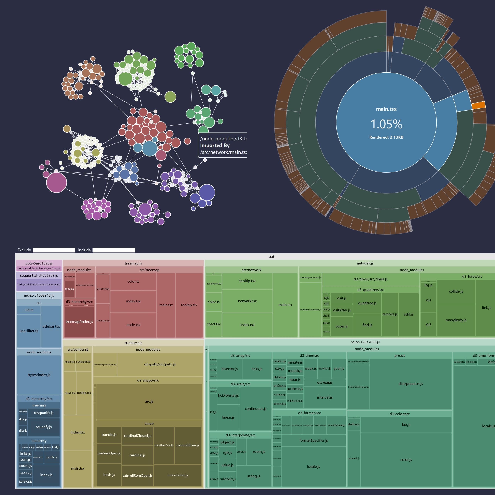

# Rollup Plugin Visualizer
번들(bundle)을 시각화하고 분석하여 어떤 모듈이 용량을 많이 차지하는지 빠르게 확인하는 도구
> [Rollup Plugin Visualizer](https://www.npmjs.com/package/rollup-plugin-visualizer)

- Node.js 22 이상 필요.
- Rolldown에서도 지원됨.(Vite 8+)



## 사용 방법

```ts
// vite.config.js
import { defineConfig, type PluginOption } from "vite";
import { visualizer } from "rollup-plugin-visualizer";

export default defineConfig({
  plugins: [visualizer() as PluginOption],
});
```